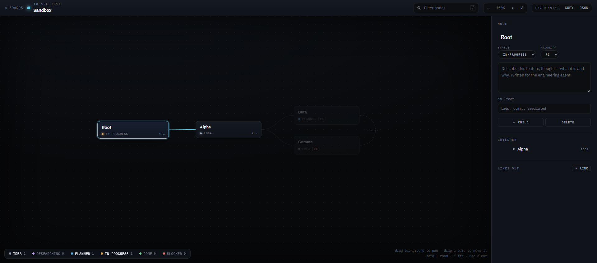

# ThoughtBoard

Per-project mindmaps and research notes with two front doors: a **dark web portal** for
humans and an **MCP tool surface** for AI agents (Claude Code, or anything that speaks
[MCP](https://modelcontextprotocol.io/)). Sketch a linked feature map in the browser;
your agent reads the same JSON over MCP and knows exactly what you're planning.



## How it works

One Python process runs both:

- an **MCP server** (stdio) exposing 13 tools for reading/writing boards, and
- a **web portal** on `http://127.0.0.1:7793/` (daemon thread) that stays up for as
  long as the MCP process lives. Run it standalone with `--portal-only` if you want
  the portal without an MCP host.

Data is plain files under `~/.thoughtboard/` — no database, no cloud:

```
~/.thoughtboard/boards/<project>/project.json
~/.thoughtboard/boards/<project>/maps/<map>.json      # schema thoughtboard/v1
~/.thoughtboard/boards/<project>/research/<doc>.md
```

## The board editor

- **Tidy-tree layout** with drag-to-move cards (positions persist as `pos` per node)
- **Nodes**: title, description, status (`idea / researching / planned / in-progress /
  done / blocked`), **priority `P0`–`P6`** (P0 highest, P3 default, P6 someday) with
  colored badges, and free-form tags
- **Cross-links** between any two nodes with editable labels (drawn dashed, routed
  around cards)
- **Re-parenting** via a pick-a-node flow (cycle-guarded)
- **Search** (`/`), per-status filter chips with live counts, pan/zoom, fit (`F`)
- **Debounced autosave** with retry — every edit lands in the JSON file within a second
- Research notes render as styled markdown pages

## Install

```bash
git clone https://github.com/naab007/ThoughtBoard.git
cd ThoughtBoard
python -m venv .venv
.venv/Scripts/pip install -r requirements.txt      # Windows
# .venv/bin/pip install -r requirements.txt        # Linux/macOS
```

Run the portal on its own:

```bash
python run_server.py --portal-only
```

Register as an MCP server for Claude Code:

```bash
claude mcp add -s user thoughtboard <abs-path>/.venv/Scripts/python.exe <abs-path>/run_server.py
```

Port defaults to `7793`; override with the `THOUGHTBOARD_PORT` env var. Data location
overrides with `THOUGHTBOARD_DATA`. If several MCP instances start (multiple agent
sessions), the first one binds the portal and the rest serve tools only against the
same data directory.

## MCP tools

| Tool | Purpose |
|---|---|
| `portal_info` | Portal URL, data dir, whether this instance hosts the portal |
| `list_projects` | All projects with their maps + research docs |
| `create_project` | New project (`slug`, `title`) |
| `get_map` / `create_map` / `delete_map` | Whole-map operations |
| `upsert_node` | Create/update a node — title, description, status, priority, tags, parent (re-parent, cycle-guarded) |
| `delete_node` | Delete a leaf node (refused while it has children) |
| `link_nodes` / `unlink_nodes` | Cross-links with labels |
| `list_research` / `get_research` / `write_research` | Markdown research docs |

Error messages are written to teach: invalid input errors enumerate the valid values
or name the discovery tool to call.

## Map schema (thoughtboard/v1)

```json
{
  "schema": "thoughtboard/v1",
  "project": "my-project", "map": "feature-map",
  "title": "Feature Map", "description": "", "updated": "2026-07-25",
  "nodes": [
    {
      "id": "stable-kebab-id",
      "title": "Feature name",
      "description": "What and why — written for an agent to act on.",
      "parent": null,
      "status": "planned",
      "priority": "p1",
      "tags": ["engine"],
      "links": [{ "to": "other-node", "label": "depends on" }],
      "pos": { "x": 640, "y": 320 }
    }
  ]
}
```

Exactly one root (`parent: null`). `priority` and `pos` are optional (`p3` and
auto-layout are the defaults). Node ids are stable — rename titles, never ids.

## Security

Loopback by default: the portal binds `127.0.0.1` and a middleware rejects requests
whose `Host` isn't local or whose `Origin` (on state-changing methods) isn't the
portal's own. All slugs pass a single validation chokepoint that rejects path
traversal. Uvicorn logging is kept off stdout so MCP stdio stays clean.

**LAN sharing** is opt-in via the `set_lan_access` MCP tool (or `lan_access` in
`~/.thoughtboard/config.json`). The running portal watches the config and rebinds
itself within ~4 s — no restart. In LAN mode it binds `0.0.0.0` but still enforces:
client IPs must be loopback, RFC1918-private, or RFC6598 shared space (100.64/10,
so Tailscale peers work); the `Host` header must be a private IP literal on the
portal port (hostnames are rejected, which defeats DNS rebinding); and writes must
be same-origin. On Windows you may need to allow Python through the firewall for
private networks.

## License

MIT — see [LICENSE](LICENSE).
